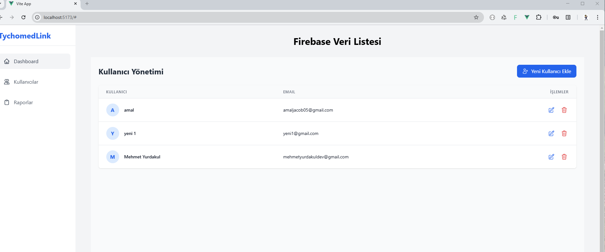
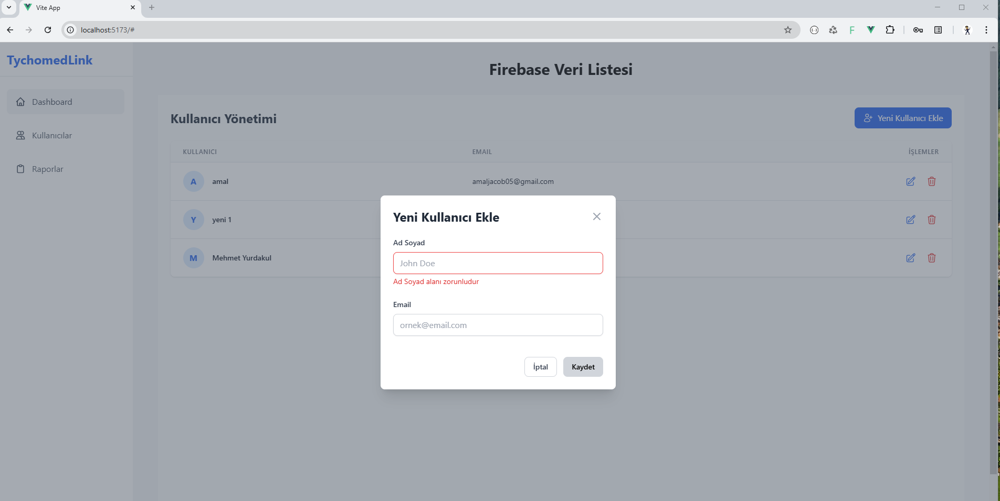
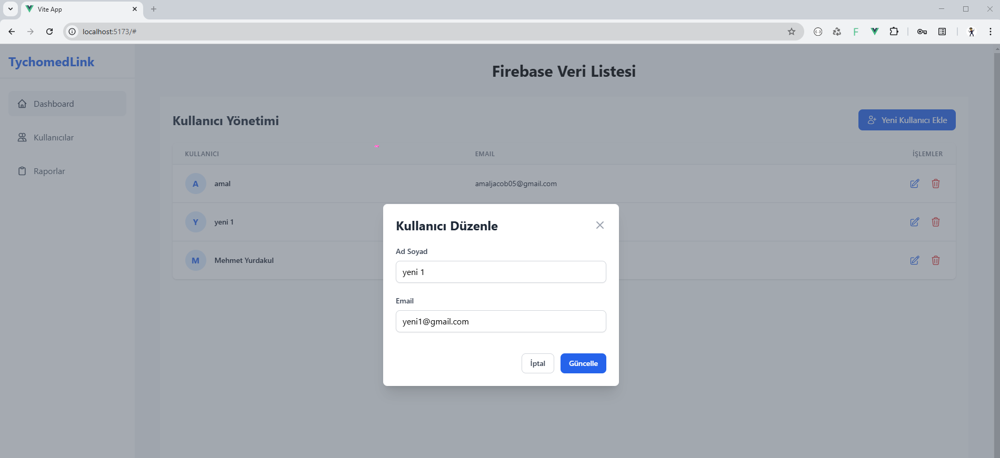
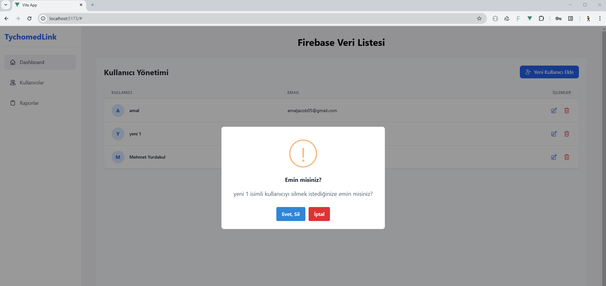
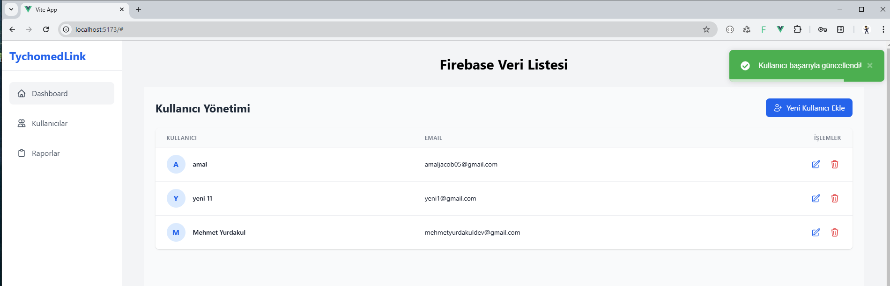

# TychomedLink

Modern web teknolojileri kullanılarak geliştirilmiş kullanıcı yönetim sistemi.

## Kullanılan Teknolojiler

- **Vue 3** - Modern web framework
- **Composition API** - Vue 3'ün reaktif programlama yaklaşımı
- **Tailwind CSS** - Utility-first CSS framework
- **Firebase/Firestore** - Gerçek zamanlı veritabanı
- **Pinia** - Vue 3 için state management
- **Vue Toastification** - Bildirim sistemi
- **SweetAlert2** - Modern dialog/alert kutuları
- **Heroicons** - Modern SVG ikonlar

## Özellikler

- 🚀 Modern ve responsive tasarım
- 📱 Mobil uyumlu arayüz
- ✨ Gerçek zamanlı CRUD işlemleri
- 🔍 Form validasyonları
- 🎨 Modern bildirim sistemi
- 🔐 Güvenli Firebase entegrasyonu
- 📊 State management ile merkezi veri yönetimi

## Proje Yapısı

- `components/` - Yeniden kullanılabilir Vue bileşenleri
- `stores/` - Pinia store dosyaları
- `firebase/` - Firebase konfigürasyonu
- `views/` - Sayfa bileşenleri

## Geliştirme Yaklaşımı

1. Modern component mimarisi
2. Composition API ile reaktif programlama
3. Merkezi state yönetimi
4. Modüler ve yeniden kullanılabilir componentler
5. Modern UI/UX pratikleri
6. Güvenli veritabanı işlemleri

## Kurulum

1. Repoyu klonlayın
2. `.env.example` dosyasını `.env` olarak kopyalayın
3. Firebase bilgilerinizi `.env` dosyasına ekleyin
4. Bağımlılıkları yükleyin: `npm install`
5. Geliştirme sunucusunu başlatın: `npm run dev`
## Ekran Görüntüleri

## Lisans

Bu proje MIT lisansı ile lisanslanmıştır.
